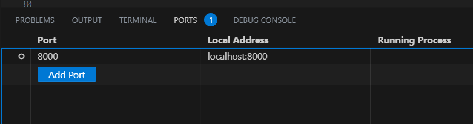
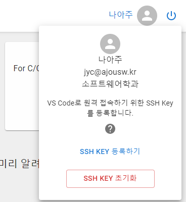

위 사진은 <a href="https://pixabay.com/ko//?utm_source=link-attribution&amp;utm_medium=referral&amp;utm_campaign=image&amp;utm_content=2781614">Pixabay</a>로부터 입수된 <a href="https://pixabay.com/ko/users/absolutvision-6158753/?utm_source=link-attribution&amp;utm_medium=referral&amp;utm_campaign=image&amp;utm_content=2781614">Gino Crescoli</a>님의 이미지 입니다.

### SSH Key를 왜 등록하는가?

노트북에 있는 VS Code로 Ajoupyterhub의 개발환경을 사용하고 싶을 때가 있습니다.

물론, Ajoupyterhub의 웹 브라우저용 `VS Code` (`Code Server`)를 사용해도 되지만, 편리한 개발을 도와주는 VS Code의 많은 Extention 구성에 차이가 있습니다.

여러분 노트북의 VS Code를 사용하면, 더 풍부하고 안정적인 VS Code Extention을 사용할 수 있는 장점이 있습니다.

또 하나는, 웹 개발을 하고, 웹 동작을 확인할 때, 웹 브라우저에서 개발할 경우, `proxy`를 활용해야 했습니다.
[블로그 참조](http://ajoupyterhub.github.io/Web-Dev-and-Test-in-VSCode_221031)

약간 불편합니다.

VS Code의 Remote Development extention은 원격 개발에 필요한 여러 기능을 가지고 있는데, 그 중 하나는 `Port Forwarding` 기능입니다.

원격 개발 중에, 웹 서버 등을 구동하면, VS Code가 `port`를 감지하여, 감지된 `port`를 여러분이 작업하는 컴퓨터에 `forwarding` 할 지를 물어보거나, 아니면, 여러분이 `port` 번호를 직접 입력하여, forwarding 할 수 있습니다.

`port forwarding`이 이루어지면, 여러분은 `http://localhost:[port 번호]/` 이런 방식으로 개발하고 있는 웹을 테스트 할 수 있습니다. (사용예: `http://localhost:3000/`)

아래 그림은 `VS Code` 의 `Terminal` 창 에서 `container port`를 forwarding 하는 모습입니다. 
 

`port forwarding`이란, 원격 서버의 `port`를 내 컴퓨터로 `tunneling`하는 방법입니다. 

인터넷에 `ssh tunneling`을 검색하면, 자세한 내용이 많이 검색될 것입니다.

 

SSH Key를 등록할 필요가 없다면, 이 글은 그만 읽어도 됩니다.

 

### SSH Key를 등록하는 방법
 

#### 1. SSH Key 만들기

먼저 여러분의 컴퓨터에서 `SSH Key`를 만듭니다. 

`SSH Key`는 `Github` 및 ajou git 서버가 사용하는 `Gitlab`에도 등록하여 사용할 수 있습니다.

 

이미 만들어진 SSH Key가 있다면, 이 섹션은 `pass` 합니다.

만들어져 있는지 모른다면, 여러분의 사용자 폴더에서 `.ssh` 폴더를 찾고 그 폴더 안에, `id_rsa`와 `id_rsa.pub` 파일이 있는지 확인하세요.

 

그 파일이 발견되었고, 그 Key 파일에 대한 암호를 기억하고 있다면 SSH Key를 다시 만들 필요는 없습니다.

Key 파일에 대한 암호가 기억나지 않으면, 다시 만들어야겠죠?

 

1. `Windows OS`에서는 `cmd` 창을 열고, `MacOS` 에서는 `Terminal`을 엽니다.
2. 커맨드 프롬프트에서 `ssh-keygen -t rsa`를 입력합니다.
3. 만들어진 key 파일을 어디에 저장할 것인지를 묻는데, 그냥 `Enter` key를 누릅니다. 기본적으로 여러분의 사용자 폴더
  > - Windows : `C:\Users\<userid>`
  > - MacOS : `/Users/<userid>`
   
  >> 밑에 `.ssh` 라는 폴더에 key 쌍을 만들어 저장할 겁니다.

4. Key File 접근을 위한 암호 (pass phrase)를 묻습니다. 암호를 넣지 않아도 됩니다. 어차피 key file이 컴퓨터에 있어야, 접속하려는 쪽에서도 인증되기 때문입니다. Key file을 안전하게 관리할 수 있다면 (PC방 PC는 곤란하겠죠?) 암호를 넣지 않아도 되지만, 기억하기 쉬운 것으로 최대한 간단히 넣을 수도 있습니다.
5. 암호를 한번 더 물어볼 겁니다. 다시 한번 입력하세요.
6. 이쯤 되면, SSH Key 파일이 만들어졌을 겁니다. `cmd` 또는 `terminal` 창에서 `dir` 또는 `ls` 명령으로 확인하기 바랍니다.   [위치는 위 3번 참조]

 

축하합니다. 여러분은 방금 ssh key 쌍을 만들었습니다.

 

#### 2. SSH Key 등록하기

1. Ajoupyterhub에 login 합니다.

2. login 후, 오른쪽 상단에, 여러분의 이름과 아바타가 보입니다.

3. 아바타를 클릭합니다. 아래와 같은 `popup`이 열립니다.

 

>> 

4. `SSH KEY 등록하기` 버튼을 누릅니다.
  > - 파일을 선택하는 창이 열립니다.
  > - key가 저장된 폴더로 이동하여, key file을 선택하면 됩니다.
  > - 공개키를 선택하도록 되어 있습니다. (파일확장자 `.pub`) 공개된 키만 다른 서버에 넘겨줍니다. 
  > - 절대로 개인키 (`id_rsa`)를 공유하면 안됩니다.
  > 
  > - 그런데, 파일 선택창 대부분이 숨겨진 파일과 폴더는 보여주지 않습니다.
  > - 인터넷에서 검색하여, 숨겨진 파일과 폴더를 보여주도록 설정을 합니다.
  >> - MacOS : `Command + Shift + .`
  >> - Windows : [클릭하여 참조](https://support.microsoft.com/en-us/windows/view-hidden-files-and-folders-in-windows-97fbc472-c603-9d90-91d0-1166d1d9f4b5#WindowsVersion=Windows_10)

5. `SSH Key`가 등록되었습니다.

 

#### 3. Test 하기

1. Ajoupyterhub의 VS Code 컨테이너를 실행합니다. (반드시 실행해야 합니다.)

2. `cmd` 창 또는 `terminal`에서 다음의 명령을 입력합니다.
  > - `ssh -p 2022 yourID@jupyter.ajou.ac.kr`
  > 
  > - 여러분의 컨테이너에 포트번호 `2022`으로 `ssh` 접속한다는 뜻입니다.
  > - Key File에 대한 암호를 입력하여 접속되는지 확인합니다.

3. 2번이 성공하면, 여러분의 노트북 VS Code에서도 Remote Development Extention을 통해, ajoupyterhub에 접속할 수 있습니다.
  > - 참고: VS Code의 Remote Development Extention은 `Tunneling, WSL, SSH` 등의 종류가 있는데, `SSH`를 선택해야 합니다.
  > - 원격 서버의 OS 종류는 묻는데, 당연히 `linux`입니다.
  > - 원격 서버 구성 설정 (`setting`)을 묻는다면, 아마도 첫번째것 (`C:\Users\userID\.ssh\config`)을 선택하세요. 

 

#### 4. Trouble Shooting

 

뭔가 잘못되어서, 안되는 경우가 있습니다.

그중에 하나가, 엉뚱한 Key File이 등록되어 있다던지, 그런 문제도 있습니다.

처음부터 다시 시작하고 싶다면,

SSH KEY 초기화 버튼을 누르세요.

 

궁금한 것이 있으면, 언제든지 질문해주세요. http://ajoupyterhub.slack.com

