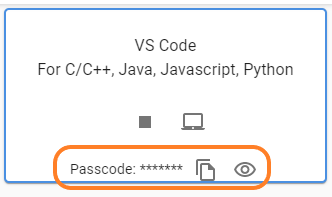
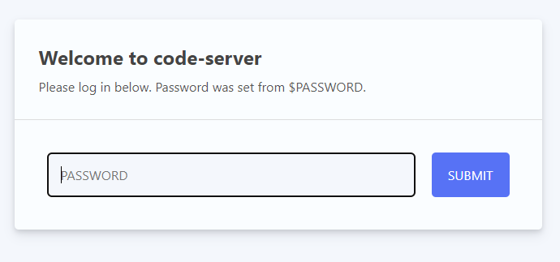

#### VSCode를 구동하고, Window를 오픈하기 전에 passcode를 복사하세요.

 

카피 버튼 또는 '눈' icon을 클릭하여 `passcode`를 복사합니다.

 
---
 

#### VSCode 오픈 후, Password 입력창에 위에서 복사한 `passcode`를 입력합니다.

 

---

 

#### Ajoupyterhub Team은 여러분의 `Code`를 지키려 꾸준히 노력하고 있습니다.

