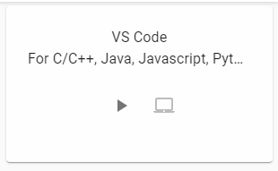
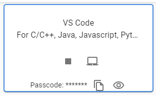
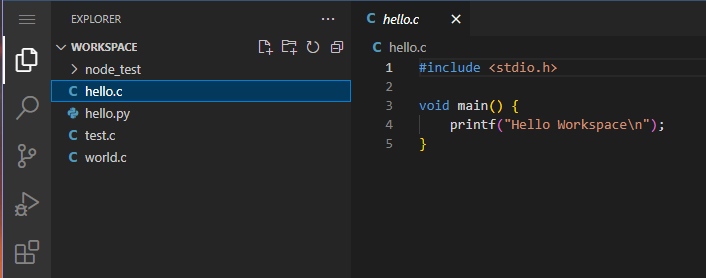
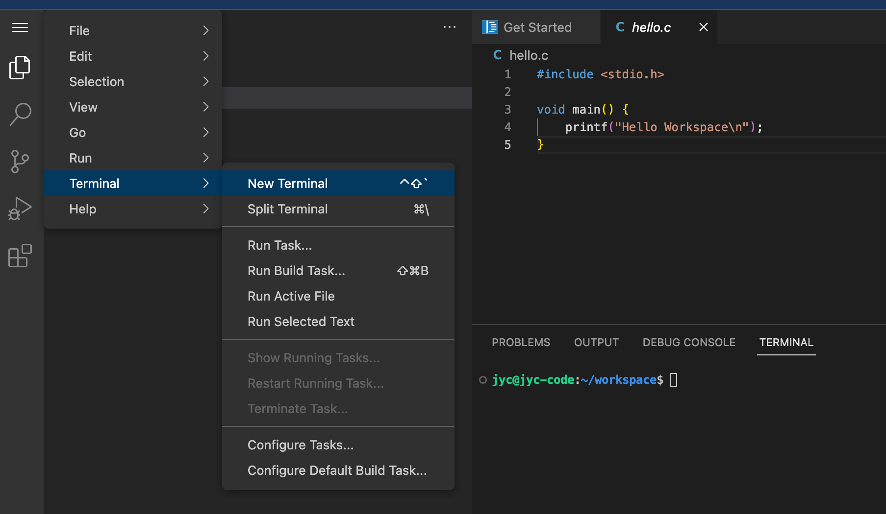

### Kubernetes 기반의 Ajoupyterhub에 VS Code 가 입주했습니다.

## VS Code server가 지원하는 프로그래밍 언어

| 언어 | 버전 | Terminal 명령 |
| --- | --- | --- |
| C/C++ | 9.4.0 | `gcc` |
| Java | 17.0.2 | `javac`, `jar`, `mvn` (Maven) |
| Python | 3.8.10 | `python3` |
| Node JS | 14.17.5 | `node` |

## Ajoupyterhub에서 VS Code 실행하기

### 1. 로그인 후, 다음 Card의 Play 버튼을 누르고, 컨테이너가 활성화 될 때까지 기다립니다.

### 2. 활성화 된 후, Play 버튼 옆 Window 버튼을 클릭합니다.

### 3. 새로 열린 창은 웹에서 사용할 수 있는 VS Code 입니다.

### 코딩 작성 후, 컴파일 및 실행은 왼쪽 위 메뉴를 열고, Terminal을 다음 그림처럼 열어서, 
`gcc`, `javac`, `node`, `mvn`, `python3` 등의 명령어로 컴파일 또는 실행합니다.

### 많은 활용 부탁드리며, 사용에 문제 있으면, 아래 코멘트에 남겨주세요.

