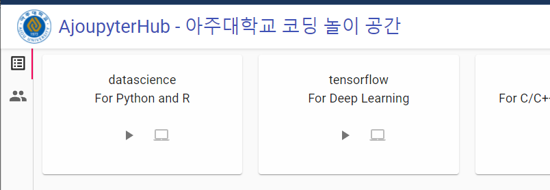
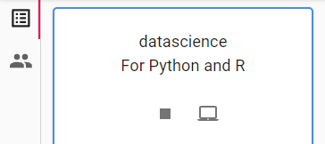
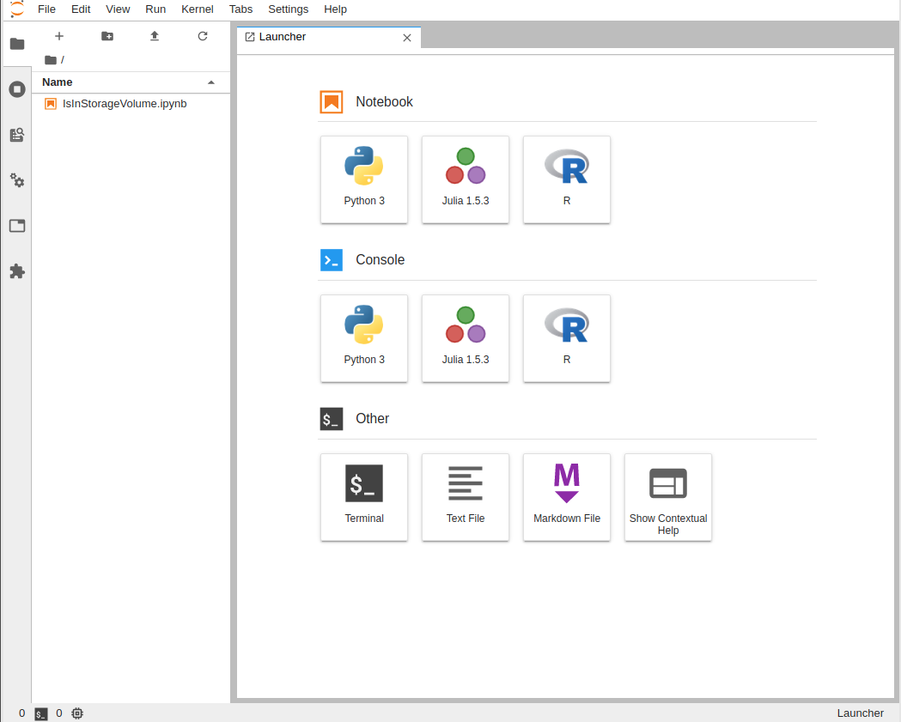
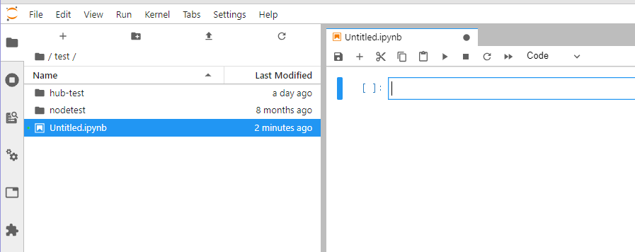
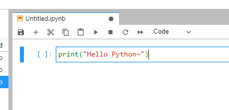
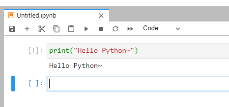

### 1. [http://jupyter.ajou.ac.kr](http://jupyter.ajou.ac.kr) 로 접속합니다.

 
 

### 2. 아주대학교 이메일 아이디로 구글 로그인 합니다.

 
 

### 3. 로그인 후, 사용가능한 노트북을 확인합니다.

 

### 4. 데이터사이언스 노트북을 실행합니다. (Play Button)

#### 아래 그림은 노트북이 실행중 일때, 표시되는 화면입니다.

#### Play Button 옆, 화면 아이콘을 클릭하면, Jupyter Notebook이 새로운 창에 표시됩니다.  

 

### 5. 새 창에 Jupyter Notebook이 새로 열린 것을 확인합니다.

왼쪽 컬럼은 현재 폴더의 내용을 보여줍니다. 왼쪽 컬럼의 윗부분에 있는 '+' 를 누르면, 새로운 Launcher가 오른쪽에 열립니다.

폴더 모양의 icon은 현재 폴더에 새로운 폴더를 만듭니다.

### 6. Launcher에서 `Python3` 또는 `R` 혹은 `Julia` 프로그래밍 언어를 선택하여 클릭합니다.

클릭하면, `untitled`로 시작하는 파일이 생기면서, 오른쪽에 Jupyter notebook이 열립니다.

notebook 파일의 **확장자** 는 `ipynb` 입니다.

왼쪽 컬럼에서 파일이름 (아마도 `untitled.ipynb`)에 오른쪽 마우스 버튼을 클릭하면, 여러가지 필요한 것을 처리할 수 있으나, 
일부 메뉴는 작동하지 않을 수 있습니다. 주로 `Rename`, `Delete`, `Download`를 실행합니다.

### 7. 열려져 있는 첫번째 `Cell`에 `print("Hello Python~")`을 입력합니다. 

Jupyter Notebook에서 입력할 수 있는 입력창을 `Cell`이라고 부릅니다.

`Cell`에 주로 프로그래밍 코드를 입력하지만, `Markdown`을 입력하여, 코드에 대한 설명을 추가할 수도 있습니다.

### 8. 입력 후에, 아이콘 메뉴 중에 플레이 버튼을 클릭합니다.

실행되면, 실행 결과가 코드 바로 아래 부분에 표시됩니다. 이런 UI (사용자 인터페이스)가 Jupyter Notebook의 특징입니다.

### 9. 새로운 `Cell`을 추가하려면, 아이콘 메뉴에서 `+` 버튼을 클릭합니다.

아이콘 메뉴의 다른 것들도 시도해보세요.