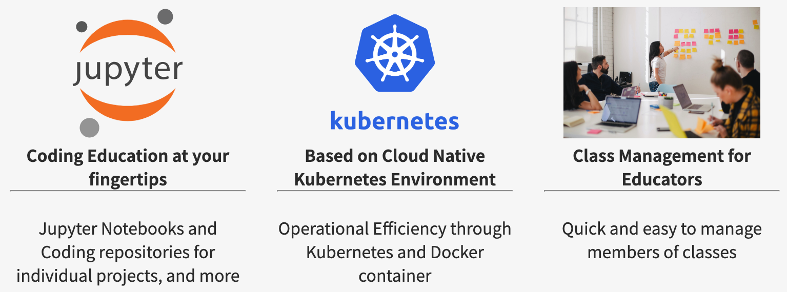

# About

**Ajoupyterhub** is a platform on which individual students and researchers can study their own subjects with their own storage.

Registered users can launch jupyter notebooks and Visual Studio Code in **Ajoupyterhub** after they signed in.

Codes developed by users are securely stored in **Ajoupyterhub** storage and can be accessed anytime, anywhere through HTML5 enabled web browsers such as Chrome, Firefox, and Edge.

Since every notebook and code-server runs in a separate and independent container, it is hard to access other users' codes and data.

**Ajoupyterhub** is built on top of state of the art cloud-native technology *Kubernetes*. 
So, it can be easily scaled out multiple servers so that it can meet capacity requirements 
of many organizations such as coporates and academic institutions.

{/* 

 */}

Please, enjoy **Ajoupyterhub**

