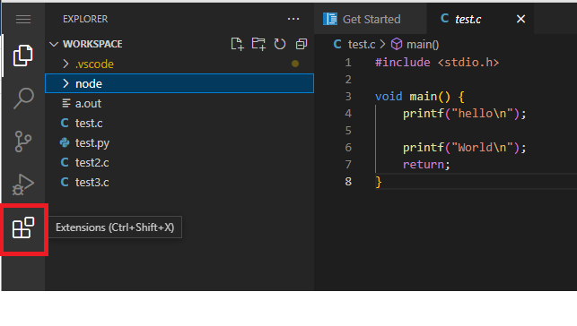
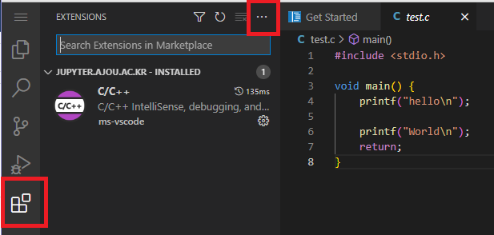
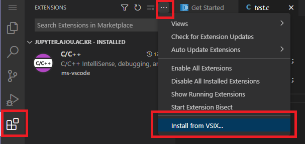
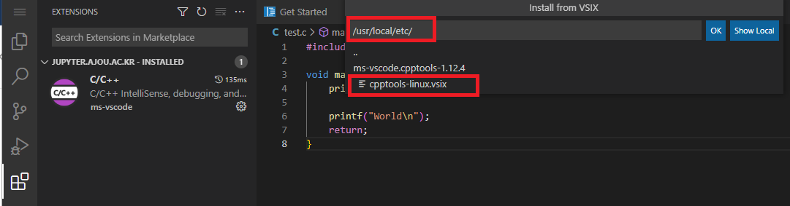

#### Code-Server에 C/C++ Debugging Extension을 설치하는 방법

Code-server용 Extension을 조회하면, Microsoft가 제공하는 Extension이 없는 경우도 있습니다. 

C/C++ 학습 및 실습에 많이 사용되는 Microsoft의 공식 Extension을 설치하는 방법을 아래와 같이 안내합니다.

 

#### 1. Extension Tab 열기

#### 2. Extension Tab에서 오른쪽 위 `...` 부분 클릭

 

#### 3. 메뉴창에서 Install from VSIX 선택

 

#### 4. 파일 경로: /usr/local/etc/cpptools-linux.vsix

 

#### 5. 설치 확인하고 사용

 

#### 6. Break Point 설정

C 또는 C++ 코드 화면에서 Break point를 설정하려는 라인의 번호 왼쪽을 클릭합니다. 

그러면, 그 부분이 빨간 점으로 바뀌면서, Break point로 설정된 것으로 표시됩니다.

 

#### 7. Run and Debug Tab 또는 실행 메뉴에서 Start Debugging 실행

Break point가 설정된 상태에서, 디버깅을 실행하면, 정해진 Break Point까지 실행하다가, 실행이 잠시 멈추고, 여러분에게 프로그램 진행 제어권을 넘기게 됩니다.

처음 사용하게 되면, 어떤 debugger를 선택할 지가 나오는데, 제일 첫번째를 선택하면 됩니다.

 

#### 8. Debugging 방법은 다른 자료를 참고하기 바랍니다.

