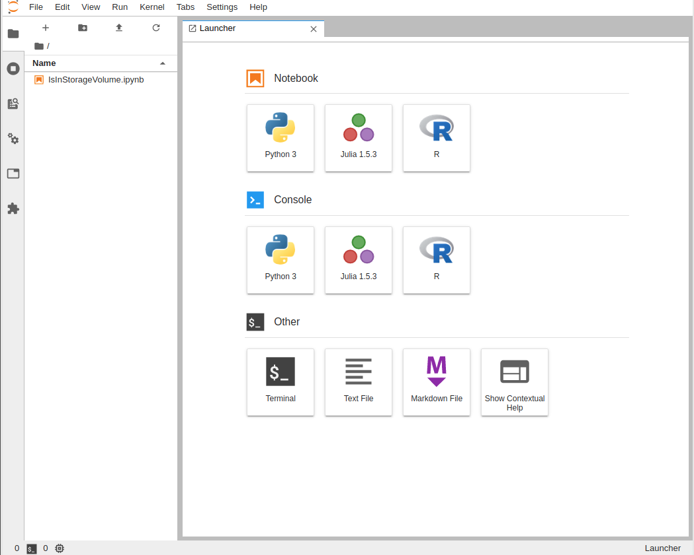

### 1. [http://jupyter.ajou.ac.kr](http://jupyter.ajou.ac.kr) 로 접속합니다.

 
 

### 2. 아주대학교 이메일 아이디로 구글 로그인 합니다.

 
 

### 3. 로그인 후, 사용가능한 노트북을 확인합니다.

 

### 4. 데이터사이언스 노트북을 실행합니다. (Play Button)

#### 아래 그림은 노트북이 실행중 일때, 표시되는 화면입니다.

#### Play Button 옆, 화면 아이콘을 클릭하면, Jupyter Notebook이 새로운 창에 표시됩니다.  

 

### 5. 새 창에 Jupyter Notebook이 새로 열린 것을 확인하고, Notebook을 사용합니다.

